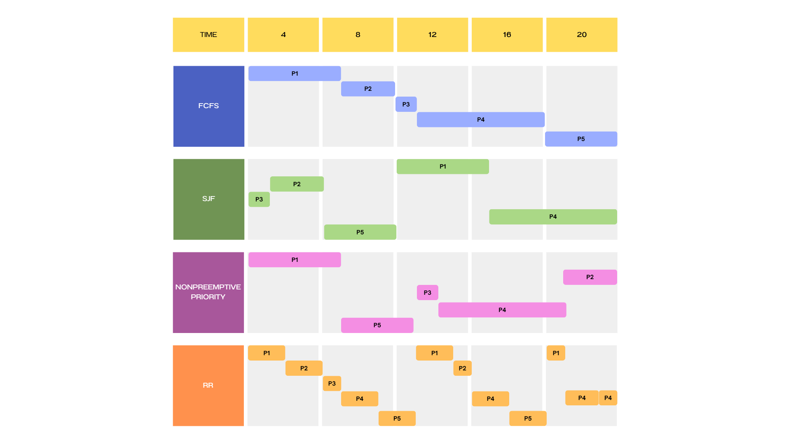

# 資財三甲 112AB0050 王界誠

## Ch4
### 4.9
- 當進程並非CPU bound型任務時，將空閒的CPU交給其它執行緒使用造成的上下文切換開銷，比CPU空閒的效能損失更小。例如讀取硬碟裡的資料。
### 4.14
- 40%
    - a: 1.5384615385
    - b: 1.6
- 67%
    - a: 1.5037593985
    - b: 2.0100502513
- 90%
    - a: 3.0769230769
    - b: 4.7058823529
### 4.20
- a: 性能最差，因為cpu核心只能運行kernel thread，它導致一定有CPU處於閒置狀態。
- b: 理論上與c相同，但實際稍差一些，因為當有一個kernel threads阻塞時，必定也會有一個CPU核心閒置無法切換到另一個執行緒
- c: 性能最好，能充分利用CPU核心，同時當有kernel threads阻塞時，CPU可以切換到另一個kernel threads執行。

## Ch5
### 5.14
- (1)
    - advantages: 不需要擔心不同核心間讀取同個資料的異步問題
    - disadvantages: 可能會有負載分配不均，導致部分核心閒置的狀況
- (2)
    - advantages: 核心一空閒就會自動從共享任務清單抓任務來做，能確保核心利用率
    - disadvantages: 跨核心的異步問題
### 5.17
- a 
- b
    - FCFS
        - P1: 5ms
        - P2: 8ms
        - P3: 9ms
        - P4: 16ms
        - P5: 20ms
    - SJF
        - P1: 13ms
        - P2: 4ms
        - P3: 1ms
        - P4: 20ms
        - P5: 8ms
    - Nonpreemptive Priority
        - P1: 5ms
        - P2: 20ms
        - P3: 10ms
        - P4: 17ms
        - P5: 9ms
    - RR
        - P1: 17ms
        - P2: 12ms
        - P3: 5ms
        - P4: 20ms
        - P5: 16ms
- c
    - FCFS
        - P1: 0ms
        - P2: 5ms
        - P3: 8ms
        - P4: 9ms
        - P5: 16ms
    - SJF
        - P1: 8ms
        - P2: 1ms
        - P3: 0ms
        - P4: 13ms
        - P5: 4ms
    - Nonpreemptive Priority
        - P1: 0ms
        - P2: 17ms
        - P3: 9ms
        - P4: 10ms
        - P5: 5ms
    - RR
        - P1: 12ms
        - P2: 9ms
        - P3: 4ms
        - P4: 13ms
        - P5: 12ms
- d
    - FCFS: 7.6ms
    - SJF: 5.2ms
    - Nonpreemptive Priority: 8.2ms
    - RR: 10ms
    Ans: SJF has the minimum average waiting time.
### 5.22
- 
### 5.25
- 

## Ch6
### 6.7
- 
### 6.15
- 
### 6.18
- 